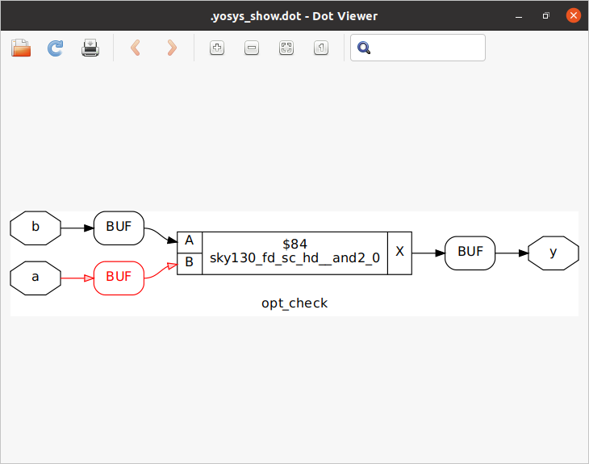
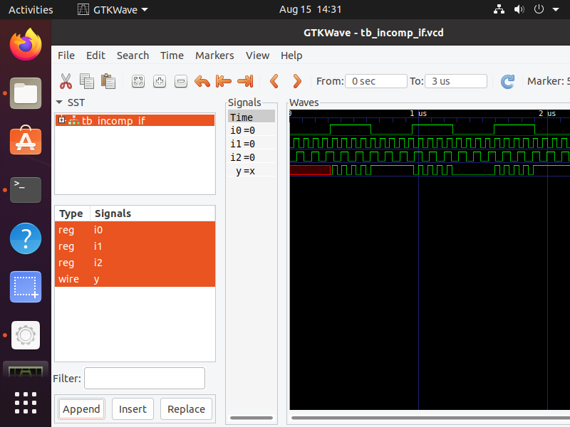
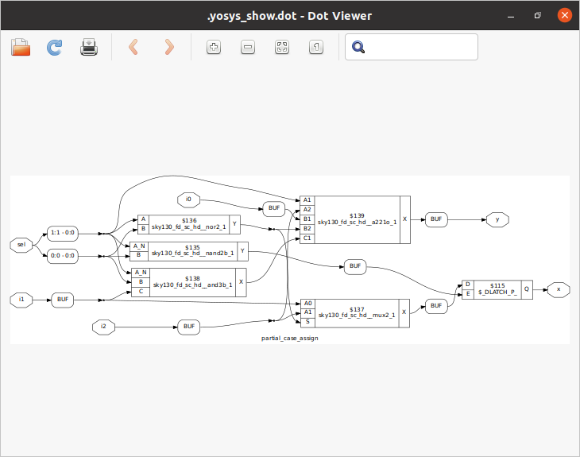

 # **# VSD-HDP-Manhattan-Project**
> -  Inspired by J.R.Oppenheimer

 ## Tools installation 
   [1]: #tools-installation

##### <u>Yosys</u>

~~~
$ git clone https://github.com/YosysHQ/yosys.git
$ cd yosys
$ sudo apt install make (If make is not installed please install it) 
$ sudo apt-get install build-essential clang bison flex \
    libreadline-dev gawk tcl-dev libffi-dev git \
    graphviz xdot pkg-config python3 libboost-system-dev \
    libboost-python-dev libboost-filesystem-dev zlib1g-dev
$ make 
$ sudo make install
~~~
&nbsp;


&nbsp;
&nbsp;
  
#### <u>iverilog</u>

```
sudo apt-get install iverilog
```


&nbsp;
&nbsp;


#### <u>gtkwave</u>

```
sudo apt update
sudo apt install gtkwave
```


#### <u>OpenSTA</u>
```plaintext
sudo apt-get install cmake clang gcctcl swig bison flex
git clone https://github.com/The-OpenROAD-Project/OpenSTA.git
cd OpenSTA
mkdir build
cd build
cmake ..
make
```


#### <u>ngspice</u>

https://sourceforge.net/projects/ngspice/files/ use this link to get the latest version ngspice file in my case its version 41 then follow the commands to extraxt and install the tool.

```plaintext
tar -zxvf ngspice-41_64.tar.gz
cd ngspice-41
mkdir release
cd release
../configure  --with-x --with-readline=yes --disable-debug
make
sudo make install
```


&nbsp;
&nbsp;
&nbsp;


### Day 1
<details>
<summary>Short Summary</summary>

The Purpose of this is to know the basic idea about the different tools in flow and use the good_mux.v to verify the functionality in iverilog by giving the stimulus and code we get the .vcd file to view in the gtkwave and next id to generate the netlist using the yosys tool . The Design and the Liberty file are given to the tool to generate the netlist using the skywater 130 Standard cell Library.
</details>
<details>
<summary>Source Files:</summary>

The verilog Codes and Liberty files are available using this repo 
https://github.com/kunalg123/sky130RTLDesignAndSynthesisWorkshop.git


I have used good_mux.v which is simple mux to verify its functionality in iverilog and gtkwave.


<br>
</details>


<details>
<summary>Simulation :</summary>

These are following commands used to simulate view waveforms 

```
iverilog <name verilog: good_mux.v> <name testbench: tb_good_mux.v>
./a.out
gtkwave tb_good_mux.vcd
```

<br>
</details>


<details>
<summary>Synthesis aka Yosys :</summary>
Follow the commands to synthesize the design to get the design view.

```
yosys> read_liberty -lib <path to lib file>
yosys> read_verilog <path to verilog file>
yosys> synth -top <top_module_name>
yosys> abc -liberty <path to lib file>
yosys> show
```


following Commands are used to generate the netlist
```
yosys> write_verilog <file_name_netlist.v>
yosys> write_verilog -noattr <file_name_netlist.v>
```

<br>
</details>

&nbsp;

### Day 2
<details>

<summary>Short Summary</summary>

The main purpose is to learn about the .lib which is a library file consists of information about the PVT corners , leakage power, area , cell delay all other information are formatted in liberty format.  It consists are variety of versions for single cell to used in multiple scenarios each cell has it own pros and cons regarding delay , area , performance . 
Next is to synthesize the multiple_modules.v in different synthesis methods(Hierarachial vs Flat) and next is to synthesize in sub-module level , where bottom-up approach is used to optimize the design and the run time of the tool other thing is the Module Instantiation technique to synthesize once and instantaite multiple time in the designs.
</details>

<details>
<summary>Synthesis :</summary>
Follow the commands to synthesize the design to get the design view.

```
yosys> read_liberty -lib <path to sky130_fd_sc_hd__tt_025C_1v80.lib>
yosys> read_verilog <name of verilog file: multiple_modules.v>
yosys> synth -top <name: multiple_modules>
yosys> abc -liberty <path to sky130_fd_sc_hd__tt_025C_1v80.lib>
yosys> show <name: multiple_modules>
yosys> write_verilog -noattr <name: multiple_modules_hier.v>
```


The following is the netlist of the design 


To get the Flatten version of synthesis use the following commands:
```
yosys> flatten
yosys> write_verilog -noattr <name: multiple_modules_flat.v>
```


<br>
</details>


<details>
<summary>Synthesis:Sub-module Level</summary>
Follow the commands to synthesize the design to get the design view.

```
yosys> read_liberty -lib <path to sky130_fd_sc_hd__tt_025C_1v80.lib>
yosys> read_verilog <name of verilog file: multiple_modules.v>
yosys> synth -top <name: sub_module1>
yosys> abc -liberty <path to sky130_fd_sc_hd__tt_025C_1v80.lib>
yosys> show <name: sub_module1>
```


<br>
</details>

<details>
<summary>Simulation: Dff_async_reset</summary>
Follow the commands to simulate and view the waveforms.

```
iverilog <name verilog: dff_asyncres.v> <name testbench: tb_dff_asyncres.v>
./a.out
gtkwave <name vcd file: tb_dff_asyncres.vcd>
```

<br>
</details>

<details>
<summary>Simulation: Dff_async_set</summary>
Follow the commands to simulate and view the waveforms.

```
iverilog <name verilog: dff_async_set.v> <name testbench: tb_dff_async_set.v>
./a.out
gtkwave <name vcd file: tb_dff_async_set.vcd>
```

<br>
</details>

<details>
<summary>Simulation: Dff_sync_reset</summary>
Follow the commands to simulate and view the waveforms.

```
iverilog <name verilog: dff_syncres.v> <name testbench: tb_dff_syncres.v>
./a.out
gtkwave <name vcd file: tb_dff_syncres.vcd>
```

<br>
</details>

<details>
<summary>Synthesis: Dff_async_reset</summary>
Follow the commands to synthesize the design and view the design .

```
yosys> read_liberty -lib <path to sky130_fd_sc_hd__tt_025C_1v80.lib>
yosys> read_verilog <name of verilog file: dff_asyncres.v>
yosys> synth -top <name: dff_asyncres>
yosys> dfflibmap -liberty <path to sky130_fd_sc_hd__tt_025C_1v80.lib>
yosys> abc -liberty <path to sky130_fd_sc_hd__tt_025C_1v80.lib>
yosys> show <name: dff_asyncres>
```

<br>
</details>

<details>
<summary>Synthesis: Dff_asyncset</summary>

Follow the commands to synthesize the design and view the design .
```
yosys> read_liberty -lib <path to sky130_fd_sc_hd__tt_025C_1v80.lib>
yosys> read_verilog <name of verilog file: dff_async_set.v>
yosys> synth -top <name: dff_async_set>
yosys> dfflibmap -liberty <path to sky130_fd_sc_hd__tt_025C_1v80.lib>
yosys> abc -liberty <path to sky130_fd_sc_hd__tt_025C_1v80.lib>
yosys> show <name: dff_async_set>
```

<br>
</details>

<details>
<summary>Synthesis: Dff_sync_reset</summary>

Follow the commands to synthesize the design and view the design .
```
yosys> read_liberty -lib <path to sky130_fd_sc_hd__tt_025C_1v80.lib>
yosys> read_verilog <name of verilog file: dff_syncres.v>
yosys> synth -top <name: dff_syncres>
yosys> dfflibmap -liberty <path to sky130_fd_sc_hd__tt_025C_1v80.lib>
yosys> abc -liberty <path to sky130_fd_sc_hd__tt_025C_1v80.lib>
yosys> show <name: dff_syncres>
```

<br>
</details>

<details>
<summary>Synthesis: Mult_2.v </summary>

Optimization of special circuits here it is the multipler .Follow the commands to synthesize the design and view the design .
```
yosys> read_liberty -lib <path to sky130_fd_sc_hd__tt_025C_1v80.lib>
yosys> read_verilog <name of verilog file: mult_2.v>
yosys> synth -top <name: mul2>
yosys> abc -liberty <path to sky130_fd_sc_hd__tt_025C_1v80.lib>
yosys> show <name: mul2>
yosys> write_verilog -noattr <name: mul2_net.v>
```
&nbsp;
```
Here there no special cells are used to synthesize the design because it doesnt require and special hardware circuit because multiplying 3 bit number with two gives appending of  1 zeros in LSB . For example 2 in binary is 010 if multipled by 2 is 4 0100
```


&nbsp;

<br>
</details>

<details>
<summary>Synthesis: Mult_8.v </summary>

Optimization of special circuits here it is the multipler .Follow the commands to synthesize the design and view the design .
```
yosys> read_liberty -lib <path to sky130_fd_sc_hd__tt_025C_1v80.lib>
yosys> read_verilog <name of verilog file: mult_2.v>
yosys> synth -top <name: mul2>
yosys> abc -liberty <path to sky130_fd_sc_hd__tt_025C_1v80.lib>
yosys> show <name: mul2>
yosys> write_verilog -noattr <name: mul2_net.v>
```
&nbsp;
```
Here there no special cells are used to synthesize the design because it doesnt require and special hardware circuit because multiplying 3 bit number with nine gives appending of  same number in LSB . For example 2 in binary is 010 if multipled by 9 is 18 010010.
```


&nbsp;


<br>
</details>

### Day 3


<details>

<summary>Short Summary</summary>

The main purpose is to learn about the different optimizations used in combinational and sequential circuits namely Constant Propagation Method , State  Reduction , Retiming ,Logic Cloning .


</details>

<details>
<summary>opt_check.v</summary>


Here the mux is optimized into and gate.
&nbsp;
use following commands to synthesize the design 
```
yosys> read_liberty -lib <path to sky130_fd_sc_hd__tt_025C_1v80.lib>
yosys> read_verilog <name of verilog file:opt_check.v>
yosys> synth -top <name: opt_check>
yosys> opt_clean -purge
yosys> abc -liberty <path to sky130_fd_sc_hd__tt_025C_1v80.lib>
yosys> show
```




</details>

<details>
<summary>opt_check2.v</summary>


Here the mux is optimized into or gate.
&nbsp;
use following commands to synthesize the design 
```
yosys> read_liberty -lib <path to sky130_fd_sc_hd__tt_025C_1v80.lib>
yosys> read_verilog <name of verilog file: opt_check2.v>
yosys> synth -top <name: opt_check2>
yosys> opt_clean -purge
yosys> abc -liberty <path to sky130_fd_sc_hd__tt_025C_1v80.lib>
yosys> show
```


</details>

<details>
<summary>opt_check3.v</summary>


Here the mux is optimized into 3-input and gate.
&nbsp;
use following commands to synthesize the design 
```
yosys> read_liberty -lib <path to sky130_fd_sc_hd__tt_025C_1v80.lib>
yosys> read_verilog <name of verilog file: opt_check3.v>
yosys> synth -top <name: opt_check3>
yosys> opt_clean -purge
yosys> abc -liberty <path to sky130_fd_sc_hd__tt_025C_1v80.lib>
yosys> show
```


</details>

<details>
<summary>opt_check4.v</summary>

use following commands to synthesize the design 
```
yosys> read_liberty -lib <path to sky130_fd_sc_hd__tt_025C_1v80.lib>
yosys> read_verilog <name of verilog file: opt_check4.v>
yosys> synth -top <name: opt_check4>
yosys> opt_clean -purge
yosys> abc -liberty <path to sky130_fd_sc_hd__tt_025C_1v80.lib>
yosys> show
```


</details>

<details>
<summary>multiple_module_opt.v</summary>

use following commands to synthesize the design 
```
yosys> read_liberty -lib <path to sky130_fd_sc_hd__tt_025C_1v80.lib>
yosys> read_verilog <name of verilog file: multiple_module_opt.v>
yosys> synth -top <name: multiple_module_opt>
yosys> flatten 
yosys> opt_clean -purge
yosys> abc -liberty <path to sky130_fd_sc_hd__tt_025C_1v80.lib>
yosys> show
```


</details>

<details>
<summary>multiple_module_opt2.v</summary>

use following commands to synthesize the design 
```
yosys> read_liberty -lib <path to sky130_fd_sc_hd__tt_025C_1v80.lib>
yosys> read_verilog <name of verilog file: multiple_module_opt.v>
yosys> synth -top <name: multiple_module_opt>
yosys> flatten 
yosys> opt_clean -purge
yosys> abc -liberty <path to sky130_fd_sc_hd__tt_025C_1v80.lib>
yosys> show
```


</details>

<details>
<summary>dff_const1.v</summary>


use following commands to simulate the design 
```
iverilog <name verilog: dff_const1.v> <name testbench: tb_dff_const1.v>
./a.out
gtkwave tb_dff_const1_.vcd
```


use following commands to synthesize the design 
```
yosys> read_liberty -lib <path to sky130_fd_sc_hd__tt_025C_1v80.lib>
yosys> read_verilog <name of verilog file: dff_const1.v>
yosys> synth -top <name: dff_const1>
yosys> dfflibmap -liberty <path to sky130_fd_sc_hd__tt_025C_1v80.lib>
yosys> abc -liberty <path to sky130_fd_sc_hd__tt_025C_1v80.lib>
yosys> show
```


</details>

<details>
<summary>dff_const2.v</summary>


use following commands to simulate the design 
```
iverilog <name verilog: dff_const2.v> <name testbench: tb_dff_const2.v
./a.out
gtkwave tb_dff_const2_.vcd
```


use following commands to synthesize the design 
```
yosys> read_liberty -lib <path to sky130_fd_sc_hd__tt_025C_1v80.lib>
yosys> read_verilog <name of verilog file: dff_const2.v>
yosys> synth -top <name: dff_const2>
yosys> dfflibmap -liberty <path to sky130_fd_sc_hd__tt_025C_1v80.lib>
yosys> abc -liberty <path to sky130_fd_sc_hd__tt_025C_1v80.lib>
yosys> show
```


</details>

<details>
<summary>dff_const3.v</summary>


use following commands to simulate the design 
```
iverilog <name verilog: dff_const3.v> <name testbench: tb_dff_const3.v
./a.out
gtkwave tb_dff_const3_.vcd
```


use following commands to synthesize the design 
```
yosys> read_liberty -lib <path to sky130_fd_sc_hd__tt_025C_1v80.lib>
yosys> read_verilog <name of verilog file: dff_const3.v>
yosys> synth -top <name: dff_const3>
yosys> dfflibmap -liberty <path to sky130_fd_sc_hd__tt_025C_1v80.lib>
yosys> abc -liberty <path to sky130_fd_sc_hd__tt_025C_1v80.lib>
yosys> show
```


</details>

<details>
<summary>dff_const4.v</summary>


use following commands to simulate the design 
```
iverilog <name verilog: dff_const4.v> <name testbench: tb_dff_const4.v
./a.out
gtkwave tb_dff_const4_.vcd
```


use following commands to synthesize the design 
```
yosys> read_liberty -lib <path to sky130_fd_sc_hd__tt_025C_1v80.lib>
yosys> read_verilog <name of verilog file: dff_const4.v>
yosys> synth -top <name: dff_const4>
yosys> dfflibmap -liberty <path to sky130_fd_sc_hd__tt_025C_1v80.lib>
yosys> abc -liberty <path to sky130_fd_sc_hd__tt_025C_1v80.lib>
yosys> show
```


</details>

<details>
<summary>dff_const5.v</summary>


use following commands to simulate the design 
```
iverilog <name verilog: dff_const5.v> <name testbench: tb_dff_const5.v
./a.out
gtkwave tb_dff_const5_.vcd
```


use following commands to synthesize the design 
```
yosys> read_liberty -lib <path to sky130_fd_sc_hd__tt_025C_1v80.lib>
yosys> read_verilog <name of verilog file: dff_const5.v>
yosys> synth -top <name: dff_const5>
yosys> dfflibmap -liberty <path to sky130_fd_sc_hd__tt_025C_1v80.lib>
yosys> abc -liberty <path to sky130_fd_sc_hd__tt_025C_1v80.lib>
yosys> show
```


</details>

<details>
<summary>counter_opt.v</summary>


use following commands to synthesize the design 
```
yosys> read_liberty -lib <path to sky130_fd_sc_hd__tt_025C_1v80.lib>
yosys> read_verilog <name of verilog file: counter_opt.v>
yosys> synth -top <name: counter_opt>
yosys> dfflibmap -liberty <path to sky130_fd_sc_hd__tt_025C_1v80.lib>
yosys> abc -liberty <path to sky130_fd_sc_hd__tt_025C_1v80.lib>
yosys> show
```


</details>

<details>
<summary>counter_opt2.v</summary>


use following commands to synthesize the design 
```
yosys> read_liberty -lib <path to sky130_fd_sc_hd__tt_025C_1v80.lib>
yosys> read_verilog <name of verilog file: counter_opt2.v>
yosys> synth -top <name: counter_opt2>
yosys> dfflibmap -liberty <path to sky130_fd_sc_hd__tt_025C_1v80.lib>
yosys> abc -liberty <path to sky130_fd_sc_hd__tt_025C_1v80.lib>
yosys> show
```


</details>

### Day 4

<details>

<summary>Short Summary</summary>

The main purpose is to learn about the Gate Level Simulation known as Post-synthesis Simulation to verify the functionality and Logical correctness  of Circuit is same as the pre-synthesis model. 


.jpeg)

.jpeg)

</details>


<details>

<summary>pre-synthesis simulation , Synthesis, post-synthesis simulation of ternary_operator_mux.v </summary>

The Following commands are used to simulate the design 

```
iverilog <name verilog: ternary_operator_mux.v> <name testbench: tb_ternary_operator_mux.v>
./a.out
gtkwave tb_ternary_operator_mux.vcd
```


The Following is Pre-synthesis simulation.

Use the following commands to synthesize the design.

```
yosys> read_liberty -lib <path to sky130_fd_sc_hd__tt_025C_1v80.lib>
yosys> read_verilog <name of verilog file: ternary_operator_mux.v>
yosys> synth -top <name: ternary_operator_mux>
yosys> abc -liberty <path to sky130_fd_sc_hd__tt_025C_1v80.lib>
yosys> write_verilog -noattr <name of netlist: ternary_operator_mux_net.v>
yosys> show
```


The Following commands to used to perform Gate level simulation.

```
iverilog <path to verilog model: ../mylib/verilog_model/primitives.v> <path to sky130_fd_sc_hd__tt_025C_1v80.lib: ../lib/sky130_fd_sc_hd__tt_025C_1v80.lib> <name netlist: ternary_operator_mux_net.v> <name testbench: tb_ternary_operator_mux.v>
./a.out
gtkwave tb_ternary_operator_mux.vcd
```


</details>

<details>

<summary>pre-synthesis simulation , Synthesis, post-synthesis simulation of bad_mux.v </summary>

The Following commands are used to simulate the design 

```
iverilog <name verilog: bad_mux.v> <name testbench: tb_bad_mux.v>
./a.out
gtkwave tb_bad_mux.vcd
```


The Following is Pre-synthesis simulation.

Use the following commands to synthesize the design.

```
yosys> read_liberty -lib <path to sky130_fd_sc_hd__tt_025C_1v80.lib>
yosys> read_verilog <name of verilog file: bad_mux.v>
yosys> synth -top <name: bad_mux>
yosys> abc -liberty <path to sky130_fd_sc_hd__tt_025C_1v80.lib>
yosys> write_verilog -noattr <name of netlist: bad_mux_net.v>
yosys> show
```


The Following commands to used to perform Gate level simulation.

```
iverilog <path to verilog model: ../mylib/verilog_model/primitives.v> <path to sky130_fd_sc_hd__tt_025C_1v80.lib: ../lib/sky130_fd_sc_hd__tt_025C_1v80.lib> <name netlist: ternary_operator_mux_net.v> <name testbench: tb_ternary_operator_mux.v>
./a.out
gtkwave tb_ternary_operator_mux.vcd
```


</details>


<details>

<summary>pre-synthesis simulation , Synthesis, post-synthesis simulation of blocking  
_caveat.v </summary>

The Following commands are used to simulate the design 

```
iverilog <name verilog: blocking_caveat.v> <name testbench: tb_blocking_caveat.v>
./a.out
gtkwave tb_blocking_caveat.vcd
```


The Following is Pre-synthesis simulation.

Use the following commands to synthesize the design.

```
yosys> read_liberty -lib <path to sky130_fd_sc_hd__tt_025C_1v80.lib>
yosys> read_verilog <name of verilog file: blocking_caveat.v>
yosys> synth -top <name: blocking_caveat>
yosys> abc -liberty <path to sky130_fd_sc_hd__tt_025C_1v80.lib>
yosys> write_verilog -noattr <name of netlist: blocking_caveat_net.v>
yosys> show
```


The Following commands to used to perform Gate level simulation.

```
iverilog <path to verilog model: ../mylib/verilog_model/primitives.v> <path to verilog model: ../mylib/verilog_model/sky130_fd_sc_hd.v> <name netlist: blocking_caveat_net.v> <name testbench: tb_blocking_caveat.v>
./a.out
gtkwave tb_blocking_caveat.vcd
```


</details>

### Day 5

<details>

<summary>Short Summary</summary>


The main purpose is to learn about the different constructs or looping  statements like if , case , for , generate are used in the design . To know about the caveats of it like improper coding style , missing blocks can leads to "inferred Latch " in the design.


.jpeg)

.jpeg)

.jpeg)

</details>

<details>

<summary> simulation , Synthesis, of incomp_if.v </summary>

The Following commands are used to simulate the design 

```
iverilog <name verilog: incomp_if.v> <name testbench: tb_incomp_if.v>
./a.out
gtkwave tb_incomp_if.vcd
```





Use the following commands to synthesize the design.

```
yosys> read_liberty -lib <path to sky130_fd_sc_hd__tt_025C_1v80.lib>
yosys> read_verilog <name of verilog file: incomp_if.v>
yosys> synth -top <name: incomp_if>
yosys> abc -liberty <path to sky130_fd_sc_hd__tt_025C_1v80.lib>
yosys> show
```


</details>
<details>

<summary> simulation , Synthesis, of incomp_if2.v </summary>

The Following commands are used to simulate the design 

```
iverilog <name verilog: incomp_if2.v> <name testbench: tb_incomp_if2.v>
./a.out
gtkwave tb_incomp_if2.vcd
```


Use the following commands to synthesize the design.

```
yosys> read_liberty -lib <path to sky130_fd_sc_hd__tt_025C_1v80.lib>
yosys> read_verilog <name of verilog file: incomp_if2.v>
yosys> synth -top <name: incomp_if2>
yosys> abc -liberty <path to sky130_fd_sc_hd__tt_025C_1v80.lib>
yosys> show
```


</details>

<details>

<summary> simulation , Synthesis, of incomp_case.v </summary>

The Following commands are used to simulate the design 

```
iverilog <name verilog: incomp_case.v> <name testbench: tb_incomp_case.v>
./a.out
gtkwave tb_incomp_case.vcd
```


Use the following commands to synthesize the design.

```
yosys> read_liberty -lib <path to sky130_fd_sc_hd__tt_025C_1v80.lib>
yosys> read_verilog <name of verilog file: incomp_case.v>
yosys> synth -top <name: incomp_case>
yosys> abc -liberty <path to sky130_fd_sc_hd__tt_025C_1v80.lib>
yosys> show
```


</details>

<details>

<summary> simulation , Synthesis, of comp_case.v </summary>

The Following commands are used to simulate the design 

```
iverilog <name verilog: comp_case.v> <name testbench: tb_comp_case.v>
./a.out
gtkwave tb_comp_case.vcd
```


Use the following commands to synthesize the design.

```
yosys> read_liberty -lib <path to sky130_fd_sc_hd__tt_025C_1v80.lib>
yosys> read_verilog <name of verilog file: comp_case.v>
yosys> synth -top <name: comp_case>
yosys> abc -liberty <path to sky130_fd_sc_hd__tt_025C_1v80.lib>
yosys> show
```


</details>

<details>

<summary>  Synthesis, of partial_case_assign.v </summary>


Use the following commands to synthesize the design.

```
yosys> read_liberty -lib <path to sky130_fd_sc_hd__tt_025C_1v80.lib>
yosys> read_verilog <name of verilog file: partial_case_assign.v>
yosys> synth -top <name: partial_case_assign>
yosys> abc -liberty <path to sky130_fd_sc_hd__tt_025C_1v80.lib>
yosys> show
```




</details>

<details>

<summary>pre-synthesis simulation , Synthesis, post-synthesis simulation of bad_case.v </summary>

The Following commands are used to simulate the design 

```
iverilog <name verilog: bad_case.v> <name testbench: tb_bad_case.v>
./a.out
gtkwave tb_bad_case.vcd
```


The Following is Pre-synthesis simulation.

Use the following commands to synthesize the design.

```
yosys> read_liberty -lib <path to sky130_fd_sc_hd__tt_025C_1v80.lib>
yosys> read_verilog <name of verilog file: bad_case.v>
yosys> synth -top <name: bad_case>
yosys> abc -liberty <path to sky130_fd_sc_hd__tt_025C_1v80.lib>
yosys> write_verilog -noattr bad_case_net.v
yosys> show
```


The Following commands to used to perform Gate level simulation.

```
iverilog <path to verilog model: ../mylib/verilog_model/primitives.v> <path to verilog model: ../mylib/verilog_model/sky130_fd_sc_hd.v> <name netlist: bad_case_net.v> <name testbench: tb_bad_case.v>
./a.out
gtkwave tb_bad_case.vcd
```


</details>


<details>

<summary>pre-synthesis simulation , Synthesis, post-synthesis simulation of mux_generate.v </summary>

The Following commands are used to simulate the design 

```
iverilog <name verilog: mux_generate.v> <name testbench: tb_mux_generate.v>
./a.out
gtkwave tb_mux_generate.vcd
```


The Following is Pre-synthesis simulation.

Use the following commands to synthesize the design.

```
yosys> read_liberty -lib <path to sky130_fd_sc_hd__tt_025C_1v80.lib>
yosys> read_verilog <name of verilog file: mux_generate.v>
yosys> synth -top <name: mux_generate>
yosys> abc -liberty <path to sky130_fd_sc_hd__tt_025C_1v80.lib>
yosys> write_verilog -noattr mux_generate_net.v
yosys> show
```


The Following commands to used to perform Gate level simulation.

```
iverilog <path to verilog model: ../mylib/verilog_model/primitives.v> <path to verilog model: ../mylib/verilog_model/sky130_fd_sc_hd.v> <name netlist: mux_generate_net.v> <name testbench: tb_mux_generate.v>
./a.out
gtkwave tb_mux_generate.vcd
```


</details>
<details>
<summary> simulation , Synthesis, of demux_case.v </summary>


The Following commands are used to simulate the design 

```
iverilog <name verilog: demux_case.v> <name testbench: tb_demux_case.v>
./a.out
gtkwave tb_demux_case.vcd
```


Use the following commands to synthesize the design.

```
yosys> read_liberty -lib <path to sky130_fd_sc_hd__tt_025C_1v80.lib>
yosys> read_verilog <name of verilog file: demux_case.v>
yosys> synth -top <name: demux_case>
yosys> abc -liberty <path to sky130_fd_sc_hd__tt_025C_1v80.lib>
yosys> show
```


</details>

<details>

<summary>pre-synthesis simulation , Synthesis, post-synthesis simulation of demux_generate.v </summary>

The Following commands are used to simulate the design 

```
iverilog <name verilog: demux_generate.v> <name testbench: tb_demux_generate.v>
./a.out
gtkwave tb_demux_generate.vcd
```


The Following is Pre-synthesis simulation.

Use the following commands to synthesize the design.

```
yosys> read_liberty -lib <path to sky130_fd_sc_hd__tt_025C_1v80.lib>
yosys> read_verilog <name of verilog file: demux_generate.v>
yosys> synth -top <name: demux_generate>
yosys> abc -liberty <path to sky130_fd_sc_hd__tt_025C_1v80.lib>
yosys> write_verilog -noattr mux_degenerate_net.v
yosys> show
```


The Following commands to used to perform Gate level simulation.

```
iverilog <path to verilog model: ../mylib/verilog_model/primitives.v> <path to verilog model: ../mylib/verilog_model/sky130_fd_sc_hd.v> <name netlist: demux_generate_net.v> <name testbench: tb_demux_generate.v>
./a.out
gtkwave tb_demux_generate.vcd
```


</details>


<details>

<summary>pre-synthesis simulation , Synthesis, post-synthesis simulation of rca.v </summary>


.jpeg)


The Following commands are used to simulate the design 

```
iverilog <name verilog: rca.v> <name verilog: fa.v> <name testbench: tb_rca.v>
./a.out
gtkwave tb_rca.vcd
```


The Following is Pre-synthesis simulation.

Use the following commands to synthesize the design.

```
yosys> read_liberty -lib <path to sky130_fd_sc_hd__tt_025C_1v80.lib>
yosys> read_verilog <name of verilog file: rca.v>
yosys> read_verilog <name of verilog file: fa.v>
yosys> synth -top <name: rca>
yosys> abc -liberty <path to sky130_fd_sc_hd__tt_025C_1v80.lib>
yosys> write_verilog -noattr rca_net.v
yosys> show
```


The Following commands to used to perform Gate level simulation.

```
iverilog <path to verilog model: ../mylib/verilog_model/primitives.v> <path to verilog model: ../mylib/verilog_model/sky130_fd_sc_hd.v> <name netlist: rca_net.v> <name testbench: tb_rca.v>
./a.out
gtkwave tb_rca.vcd
```


</details>

### Day 6 

## Sequence Detector of "110101" using mealy machine.

<details>

<summary>Short Summary</summary>
In this design, I am going to detect the sequence “110101” using Mealy finite state machine.

</details>

<details>

<summary>Introduction</summary>
A Mealy machine is defined as a sequential network whose output is a function of both the present state and the input to the network. The state diagram for a Mealy machine has the output associated with the transition between states, as shown in the state diagram. Outputs are shown on transitions since they are determined in the same way as is the next state. In a Mealy machine, it may be possible to represent both combinations using the same state and to compute the single bit directly from the inputs. Hence, less states. With a Mealy machine, the outputs are computer from the state and current inputs and will not be ready for some time after the start of the clock cycle. It is capable of generating many different patterns of output signals for the same state, depending on the inputs present on the clock cycle.

.jpeg)


</details>


<details>

<summary>pre-synthesis simulation , Synthesis, post-synthesis simulation of manhattan_sequencedetector.v </summary>

The Following commands are used to simulate the design 

```
iverilog <name verilog: manhattan_sequencedetector.v> <name testbench: tb_manhattan_sequencedetector.v>
./a.out
gtkwave manseqdector.vcd
```


The Following is Pre-synthesis simulation.

Use the following commands to synthesize the design.

```
yosys> read_liberty -lib <path to sky130_fd_sc_hd__tt_025C_1v80.lib>
yosys> read_verilog <name of verilog file: manhattan_sequencedetector.v>
yosys> synth -top <name: manhattan_sequencedetector.v>
yosys> dfflibmap -liberty <path to sky130_fd_sc_hd__tt_025C_1v80.lib>
yosys> abc -liberty <path to sky130_fd_sc_hd__tt_025C_1v80.lib>
yosys> opt_clean -purge
yosys> flatten
yosys> write_verilog -noattr manhattan_sequencedetector_net.v
yosys> show
```


The gatelevel netlist of this design.

```
/* Generated by Yosys 0.31+13 (git sha1 411b6e98c, clang 10.0.0-4ubuntu1 -fPIC -Os) */

module manhattan_sequencedetector(sequence_in, clock, reset, detector_out);
  wire _00_;
  wire _01_;
  wire _02_;
  wire _03_;
  wire _04_;
  wire _05_;
  wire _06_;
  wire _07_;
  wire _08_;
  wire _09_;
  wire _10_;
  wire _11_;
  wire _12_;
  wire _13_;
  wire _14_;
  input clock;
  wire clock;
  wire [2:0] current_state;
  output detector_out;
  wire detector_out;
  wire [2:0] next_state;
  input reset;
  wire reset;
  input sequence_in;
  wire sequence_in;
  sky130_fd_sc_hd__clkinv_1 _15_ (
    .A(reset),
    .Y(_00_)
  );
  sky130_fd_sc_hd__nor2_1 _16_ (
    .A(current_state[1]),
    .B(current_state[0]),
    .Y(_04_)
  );
  sky130_fd_sc_hd__nor3b_1 _17_ (
    .A(current_state[1]),
    .B(current_state[0]),
    .C_N(current_state[2]),
    .Y(_05_)
  );
  sky130_fd_sc_hd__nor2_1 _18_ (
    .A(sequence_in),
    .B(_05_),
    .Y(_06_)
  );
  sky130_fd_sc_hd__and3b_1 _19_ (
    .A_N(current_state[1]),
    .B(current_state[0]),
    .C(current_state[2]),
    .X(_07_)
  );
  sky130_fd_sc_hd__o22ai_1 _20_ (
    .A1(sequence_in),
    .A2(_05_),
    .B1(_07_),
    .B2(_04_),
    .Y(_08_)
  );
  sky130_fd_sc_hd__nor2b_1 _21_ (
    .A(current_state[2]),
    .B_N(current_state[1]),
    .Y(_09_)
  );
  sky130_fd_sc_hd__nand2_1 _22_ (
    .A(current_state[0]),
    .B(_09_),
    .Y(_10_)
  );
  sky130_fd_sc_hd__nor3b_1 _23_ (
    .A(current_state[1]),
    .B(current_state[2]),
    .C_N(current_state[0]),
    .Y(_11_)
  );
  sky130_fd_sc_hd__o31ai_1 _24_ (
    .A1(sequence_in),
    .A2(current_state[2]),
    .A3(_04_),
    .B1(_08_),
    .Y(next_state[0])
  );
  sky130_fd_sc_hd__o21ai_0 _25_ (
    .A1(_05_),
    .A2(_11_),
    .B1(sequence_in),
    .Y(_12_)
  );
  sky130_fd_sc_hd__nand2_1 _26_ (
    .A(sequence_in),
    .B(current_state[0]),
    .Y(_13_)
  );
  sky130_fd_sc_hd__nand2_1 _27_ (
    .A(_09_),
    .B(_13_),
    .Y(_14_)
  );
  sky130_fd_sc_hd__nand2_1 _28_ (
    .A(_12_),
    .B(_14_),
    .Y(next_state[1])
  );
  sky130_fd_sc_hd__a21oi_1 _29_ (
    .A1(sequence_in),
    .A2(_10_),
    .B1(_06_),
    .Y(next_state[2])
  );
  sky130_fd_sc_hd__and3_1 _30_ (
    .A(sequence_in),
    .B(_00_),
    .C(_07_),
    .X(_03_)
  );
  sky130_fd_sc_hd__clkinv_1 _31_ (
    .A(reset),
    .Y(_01_)
  );
  sky130_fd_sc_hd__clkinv_1 _32_ (
    .A(reset),
    .Y(_02_)
  );
  sky130_fd_sc_hd__dfxtp_1 _33_ (
    .CLK(clock),
    .D(_03_),
    .Q(detector_out)
  );
  sky130_fd_sc_hd__dfrtp_1 _34_ (
    .CLK(clock),
    .D(next_state[0]),
    .Q(current_state[0]),
    .RESET_B(_00_)
  );
  sky130_fd_sc_hd__dfrtp_1 _35_ (
    .CLK(clock),
    .D(next_state[1]),
    .Q(current_state[1]),
    .RESET_B(_01_)
  );
  sky130_fd_sc_hd__dfrtp_1 _36_ (
    .CLK(clock),
    .D(next_state[2]),
    .Q(current_state[2]),
    .RESET_B(_02_)
  );
endmodule

```


The Following commands to used to perform Gate level simulation.

```
iverilog <path to verilog model: ../mylib/verilog_model/primitives.v> <path to verilog model: ../mylib/verilog_model/sky130_fd_sc_hd.v> <name netlist: manhattan_sequencedetector_net.v> <name testbench: tb_manhattan_sequencedetector.v>
./a.out
gtkwave manseqdectector.vcd
```


Here we can confirm that there is no mismatch between the presynthesis and postsynthesis simulation.

</details>


### Day 7

<details>

<summary>Short Summary</summary>
In this module we learned about the basic of STA(Static Timing Analysis) and Delay of Cells ,Timings arcs , to develop constraints or SDC (Synopsys Design Constraints) Format . Analysis of .lib file like lut of delay model , unateness , power , area of different cells and to use tcl scripts to perform some activties on lib files.
 
</details>

<details>
<summary>Introduction to STA</summary>


Static timing analysis (STA) is a method of validating the timing performance of a design by checking all possible paths for timing violations. STA breaks a design down into timing paths, calculates the signal propagation delay along each path, and checks for violations of timing constraints inside the design and at the input/output interface.


.jpg)

Here  let us consider given circuit  Max delay is given Tclk >= Tc-q + Tcomb +Tsetup. Let us consider the frequency of operation is 200 Mhz where time period is 5ns . Simplifying the equation we get  Tcomb = 5-Tc-q-Tsetup.


.jpg)

Here water bucket analogy is used to understand the effects of delay in Digital Circuits 

We can conclude that Delay is f(input transition , output capacitance).


.jpg)


As input transition increases delay increase.similarly when load capacitance increases the delay incereases vice versa.

</details>

<details>
<summary>Timing arcs</summary>

&nbsp;

There are two types of timings arcs:
1) Combinational Timing arc
2) Sequential Timing arc
.jpg)

.jpg)

</details>

<details>
<summary>Constraints</summary>
SDC is a short form of “Synopsys Design Constraint”. SDC is a common format for constraining the design which is supported by almost all Synthesis, PnR and other tools. Generally, timing, power and area constraints of design are provided through the SDC file and this file has extension .sdc. 

SDC file syntax is based on TCL format and all commands of sdc file follow the TCL syntax. In sdc file ‘#’ is used to comment a line and ” is used to break the line. SDC file can be generated by the synthesis tool and the same can be used in for PnR.


.jpg)

Here path A is called  critical path .

.jpg)


.jpg)


.jpg)


.jpg)


.jpg)


.jpg)

</details>

<details>
<summary>Analysis of .lib file</summary>


.jpg)


.jpg)

.jpg)

.jpg)

</details>


<details>
<summary>some commands used in dc_shell</summary>

```
list_lib
```

```plaintext
foreach_in_collection <looping variable: my_lib_cell> [get_lib_cells */*and] {
set <another variable: my_lib_cell_name [get_object_name $my_lib_cell];
echo $my_lib_cell_name; 
}
```


```plaintext
get_lib_pins <path/librarycellnamefromprevcommand/*> 
foreach_in_collection <variable name: my_pins> [get_lib_pins <path/librarycellnamefromprevcommand/*>] {
set <another variable: my_pin_name [get_object_name $my_pins];
set <another variable: pin_dir> [get_lib_attribute $my_pin_name <attribute name:direction>];
echo $my_pin_name $pin_dir;
}
```

```plaintext
get_lib_attribute <nameoflibpinfromprevcommands> function
get_lib_attribute <nameofcellfromprevcommands> area
get_lib_attribute <nameoflibpinfromprevcommands> capacitance
get_lib_attribute <nameoflibpinfromprevcommands> clock
```

```plaintext
set <variable name: my_list> [list <path/librarycellnamefromprevcommand \
path/librarycellnamefromprevcommand\
path/librarycellnamefromprevcommand ]
foreach <variable name: my_cell> $my_list {
	foreach_in_collection <variable name: my_lib_pin> [get_lib_pins $(my_cell)/*] {
		set <variable name: my_lib_pin_name> [get_object_name $my_lib_pin];
		set <variable name: a> [get_lib_attribute $my_lib_pin_name direction];
		if { $a > 1 } {
			set <variable name: fn> [get_lib_attribute $my_lib_pin_name function];
			echo $my_lib_pin_name $a $fn;
		}
	}
```


```plaintext
get_lib_cells */* -filter "is_sequential == true"
```


```plaintext
list_attributes -app > <name: a>
```

</details>


### Day 8 


<details>
<summary>Summary</summary>

Here we have learnt to write sdc ( synopsys design constraints) for the design . There are lot constraints for clock , input ,output , internal paths, combinational paths.


</details>


<details>
<summary>Clock modeling and SDC generation</summary>


</details>


### Day 9


<details>
<summary>Summary</summary>

I have written constraints for my design named it as manhattanseq_constraints.sdc to run opensta tool get the timing reports and manhattanscript.tcl to automate flow in opensta tool.

</details>

<details>
<summary>Constraints to my design </summary>


```plaintext

#clock constraints
create_clock -name clk1 -period 10 [get_ports clock] 
set_clock_latency -source 1 [get_clocks clk1]
set_clock_latency 2 [get_clocks clk1]
set_clock_uncertainty 0.6 [get_clocks clk1]
set_clock_uncertainty 0.1 [get_clocks clk1]

#input constraints
#set_driving_cell -lib_cell sky130_fd_sc_hd__buf_4 [all_inputs]
set_input_transition -max 0.4 [get_ports sequence_in]
set_input_transition -min 0.2 [get_ports sequence_in]
set_input_transition -max 0.4 [get_ports reset]
set_input_transition -max 0.2 [get_ports reset]
set_input_delay -max 3 -clock  clk1  [get_ports sequence_in]
set_input_delay -min 1 -clock  clk1  [get_ports sequence_in]
set_input_delay -max 3 -clock clk1   [get_ports reset]
set_input_delay -min 1 -clock  clk1 [get_ports reset]

#output constraints 
set_output_delay -max 3 -clock clk1 [get_ports detector_out]
set_output_delay -min 1  -clock  clk1 [get_ports detector_out]
set_load  -max 0.2 [get_ports detector_out]
set_load -min 0.05 [get_ports detector_out]
```

</details>

<details>
<summary>Insights of manhattanscript.tcl </summary>

```plaintext
read_liberty sky130_fd_sc_hd__tt_025C_1v80.lib

read_verilog manhattan_sequencedetector_net.v

link_design manhattan_sequencedetector

read_sdc manhattanseq_constraints.sdc

report_checks -fields {nets cap slew input_pins} -digits {5} > manhattan_timing.rpt
```
To run this script in opensta , we use this command 
```plaintext
sta manhattanscript.tcl
```

</details>


<details>
<summary>Timing reports </summary>


</details>

### Day 10 

<details>
<summary> Summary </summary>

Here we are going to discuss of mos charactersitcs like Ids vs Vds , and all parameters related to it . Spice File are most important in delay analysis which gives all information  about the delay which used in Post CTS .
</details>

<details>
<summary> Intro. to SPICE </summary>


</details>

<details>
<summary> SPICE Syntax  </summary>

Following are the spice syntax file given to tools for simulation.


```plaintext
.LIB "<name: xxx>.mod" CMOS_MODELS
R<name> <1st node> <second node> <value>
M<name> <drain> <gate> <source> <bulk> <name in tech file> w=<value> L=<value>
V<name> <1st node> <second node> <value>
C<name> <1st node> <second node> <value>
```

```plaintext
.lib cmos_models
.Model <name that should match in netlist> NMOS (TOX = .. VTH0 = .. U0 = .. GAMMA1 = ..)
.Model <name that should match in netlist> PMOS (TOX = .. VTH0 = .. U0 = .. GAMMA1 = ..)
.endl
```

```plaintext
.<mode: dc> <voltage node to sweep: Vin> <start value: 0> <end value: 2.5> <steps: 0.1> <voltage node to sweep: Vdd> <start value: 0> <end value: 2.5> <steps: 2.5>
```


ngspice tool is used to view the simulation and follw the commands to get the output.

```plaintext
ngspice <spice file name>
plot -<name node>
```

</details>

<details>
<summary> SPICE Simulation : Lab 1  </summary>

```plaintext
ngspice <name: day1_nfet_idvds_L2_W5.spice>
plot -<name: vdd#branch>
```


</details>


### Day 11 

<details>
<summary> Summary  </summary>

Here we are going learn more about the mos charactersitcs.
</details>

<details>
<summary> Theory  </summary>


</details>


<details>
<summary> Spice Simulation : Lab 2a  </summary>


```plaintext
ngspice <name: day2_nfet_idvds_L015_W039.spice>
plot -<name: vdd#branch>
```


</details>


<details>
<summary> Spice Simulation : Lab 2b </summary>

```plaintext
ngspice <name: day2_nfet_idvgs_L015_W039.spice>
plot -<name: vdd#branch>
```


</details>

### Day 12

<details>
<summary> Summary </summary>

Here we are going to learn some more about the mos charactersitcs: Swtiching threshold and applications of it used in STA.

</details>


<details>
<summary> Theory</summary>


</details>

<details>
<summary> SPICE Simulation : Lab 3a </summary>


```plaintext
ngspice <name: day3_inv_vtc_Wp084_Wn036.spice>
plot <name: out> vs <name: in>
```


</details>

<details>
<summary> SPICE Simulation : Lab 3b </summary>


```plaintext
ngspice <name: day3_inv_tran_Wp084_Wn036.spice>
plot <name: out> vs <name: time> <name: in>
```


</details>


### Day 13 

<details>
<summary> Summary </summary>

Here we are going to learn some more about the CMOS Charactersitcs : Noise Margin
</details>

<details>
<summary> Theory </summary>


</details>

<details>
<summary> SPICE Simulation : Lab 4 </summary>

```plaintext
ngspice <name: day4_inv_noisemargin_wp1_wn036.spice>
plot <name: out> vs <name: in>
```


Here Noise Margin low is 0.63 V and Noise Margin High is 0.71 V

</details>


### Day 14

<details>
<summary> Summary </summary>

Here we are going to learn CMOS charactersitcs : Supply Variation , Device Variation like process variation and gate oxide variation and its effects .

</details>

<details>
<summary> Theory </summary>


</details>

<details>
<summary> SPICE Simulation: Lab 5a </summary>

```plaintext
ngspice <name: day5_inv_supplyvariation_Wp1_Wn036.spice>
```


For 1.8 v Gain is |(1.75-0.11/0.71-0.97)| = 1.65/0.26 = 6.33  

For 0.8 v Gain is |(0.77-0.02)/(0.42-0.50)| =
0.75/0.08 = 9.375

Here we can observe that in lower nodes decrease in supply voltage leads to increase in Gain but performance decreases.

</details>


<details>
<summary> SPICE Simulation: Lab 5b </summary>

```plaintext
ngspice <name: day5_inv_devicevariation_wp7_wn042.spice>
plot <name: out> vs <name: in>
```


Even though their is a larger varaition in the device that is width changes due to process variation but their is less impact on the saturation voltage point . Ideally 0.9 v is Vsat but now its 0.989 v . 

We can conclude that CMOS is robust.

</details>


