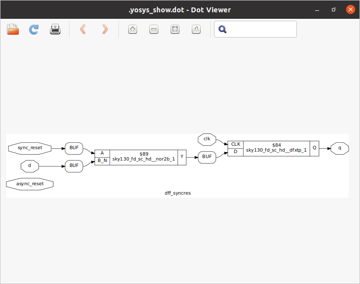

 # **# VSD-HDP-Manhattan-Project**
> -  Inspired by J.R.Oppenheimer


## Table of Contents

+ [ Tools installation][1]

1. [Yosys](#####%20<u>Yosys</u>)
2. [iverilog](#markdigsyntaxinlineshtmlinlineiverilogmarkdigsyntaxinlineshtmlinline)
3. [gtkwave](#markdigsyntaxinlineshtmlinlinegtkwavemarkdigsyntaxinlineshtmlinline)

&nbsp;
&nbsp;


 ## Tools installation 
   [1]: #tools-installation

##### <u>Yosys</u>


~~~
$ git clone https://github.com/YosysHQ/yosys.git
$ cd yosys
$ sudo apt install make (If make is not installed please install it) 
$ sudo apt-get install build-essential clang bison flex \
    libreadline-dev gawk tcl-dev libffi-dev git \
    graphviz xdot pkg-config python3 libboost-system-dev \
    libboost-python-dev libboost-filesystem-dev zlib1g-dev
$ make 
$ sudo make install
~~~
&nbsp;


&nbsp;
&nbsp;
  
#### <u>iverilog</u>

```
sudo apt-get install iverilog
```


&nbsp;
&nbsp;


#### <u>gtkwave</u>

```
sudo apt update
sudo apt install gtkwave
```


&nbsp;
&nbsp;
&nbsp;


<details>
<summary>Day 1</summary>
<br>
<details>
<summary>Short Summary</summary>

The Purpose of this is to know the basic idea about the different tools in flow and use the good_mux.v to verify the functionality in iverilog by giving the stimulus and code we get the .vcd file to view in the gtkwave and next id to generate the netlist using the yosys tool . The Design and the Liberty file are given to the tool to generate the netlist using the skywater 130 Standard cell Library.
</details>
&nbsp;
&nbsp;
&nbsp;

<details>
<summary>Source Files:</summary>

The verilog Codes and Liberty files are available using this repo 
https://github.com/kunalg123/sky130RTLDesignAndSynthesisWorkshop.git


I have used good_mux.v which is simple mux to verify its functionality in iverilog and gtkwave.


<br>
</details>

&nbsp;
<details>
<summary>Simulation :</summary>

These are following commands used to simulate view waveforms 

```
iverilog <name verilog: good_mux.v> <name testbench: tb_good_mux.v>
./a.out
gtkwave tb_good_mux.vcd
```

<br>
</details>


<details>
<summary>Synthesis aka Yosys :</summary>
Follow the commands to synthesize the design to get the design view.

```
yosys> read_liberty -lib <path to lib file>
yosys> read_verilog <path to verilog file>
yosys> synth -top <top_module_name>
yosys> abc -liberty <path to lib file>
yosys> show
```


following Commands are used to generate the netlist
```
yosys> write_verilog <file_name_netlist.v>
yosys> write_verilog -noattr <file_name_netlist.v>
```

<br>
</details>

<div style='page-break-after: always'></div>

Day 2
<details>

<summary>Short Summary</summary>

The main purpose is to learn about the .lib which is a library file consists of information about the PVT corners , leakage power, area , cell delay all other information are formatted in liberty format.  It consists are variety of versions for single cell to used in multiple scenarios each cell has it own pros and cons regarding delay , area , performance . 
Next is to synthesize the multiple_modules.v in different synthesis methods(Hierarachial vs Flat) and next is to synthesize in sub-module level , where bottom-up approach is used to optimize the design and the run time of the tool other thing is the Module Instantiation technique to synthesize once and instantaite multiple time in the designs.
</details>
&nbsp;
&nbsp;
&nbsp;

<details>
<summary>Synthesis  :</summary>
Follow the commands to synthesize the design to get the design view.

```
yosys> read_liberty -lib <path to sky130_fd_sc_hd__tt_025C_1v80.lib>
yosys> read_verilog <name of verilog file: multiple_modules.v>
yosys> synth -top <name: multiple_modules>
yosys> abc -liberty <path to sky130_fd_sc_hd__tt_025C_1v80.lib>
yosys> show <name: multiple_modules>
yosys> write_verilog -noattr <name: multiple_modules_hier.v>
```


The following is the netlist of the design 


To get the Flatten version of synthesis use the following commands:
```
yosys> flatten
yosys> write_verilog -noattr <name: multiple_modules_flat.v>
```


<br>
</details>


<details>
<summary>Synthesis:Sub-module Level</summary>
Follow the commands to synthesize the design to get the design view.

```
yosys> read_liberty -lib <path to sky130_fd_sc_hd__tt_025C_1v80.lib>
yosys> read_verilog <name of verilog file: multiple_modules.v>
yosys> synth -top <name: sub_module1>
yosys> abc -liberty <path to sky130_fd_sc_hd__tt_025C_1v80.lib>
yosys> show <name: sub_module1>
```


<br>
</details>


  
#### <u>iverilog</u>

```
sudo apt-get install iverilog
```


&nbsp;
&nbsp;


#### <u>gtkwave</u>

```
sudo apt update
sudo apt install gtkwave
```


&nbsp;
&nbsp;
&nbsp;

### Day 1
<details>
<summary>Short Summary</summary>

The Purpose of this is to know the basic idea about the different tools in flow and use the good_mux.v to verify the functionality in iverilog by giving the stimulus and code we get the .vcd file to view in the gtkwave and next id to generate the netlist using the yosys tool . The Design and the Liberty file are given to the tool to generate the netlist using the skywater 130 Standard cell Library.
</details>
&nbsp;
&nbsp;
&nbsp;

<details>
<summary>Source Files:</summary>

The verilog Codes and Liberty files are available using this repo 
https://github.com/kunalg123/sky130RTLDesignAndSynthesisWorkshop.git


I have used good_mux.v which is simple mux to verify its functionality in iverilog and gtkwave.


<br>
</details>

&nbsp;
<details>
<summary>Simulation :</summary>

These are following commands used to simulate view waveforms 

```
iverilog <name verilog: good_mux.v> <name testbench: tb_good_mux.v>
./a.out
gtkwave tb_good_mux.vcd
```

<br>
</details>


<details>
<summary>Synthesis aka Yosys :</summary>
Follow the commands to synthesize the design to get the design view.

```
yosys> read_liberty -lib <path to lib file>
yosys> read_verilog <path to verilog file>
yosys> synth -top <top_module_name>
yosys> abc -liberty <path to lib file>
yosys> show
```


following Commands are used to generate the netlist
```
yosys> write_verilog <file_name_netlist.v>
yosys> write_verilog -noattr <file_name_netlist.v>
```

<br>
</details>

&nbsp;

### Day 2
<details>

<summary>Short Summary</summary>

The main purpose is to learn about the .lib which is a library file consists of information about the PVT corners , leakage power, area , cell delay all other information are formatted in liberty format.  It consists are variety of versions for single cell to used in multiple scenarios each cell has it own pros and cons regarding delay , area , performance . 
Next is to synthesize the multiple_modules.v in different synthesis methods(Hierarachial vs Flat) and next is to synthesize in sub-module level , where bottom-up approach is used to optimize the design and the run time of the tool other thing is the Module Instantiation technique to synthesize once and instantaite multiple time in the designs.
</details>

&nbsp;
&nbsp;
&nbsp;

<details>
<summary>Synthesis :</summary>
Follow the commands to synthesize the design to get the design view.

```
yosys> read_liberty -lib <path to sky130_fd_sc_hd__tt_025C_1v80.lib>
yosys> read_verilog <name of verilog file: multiple_modules.v>
yosys> synth -top <name: multiple_modules>
yosys> abc -liberty <path to sky130_fd_sc_hd__tt_025C_1v80.lib>
yosys> show <name: multiple_modules>
yosys> write_verilog -noattr <name: multiple_modules_hier.v>
```


The following is the netlist of the design 


To get the Flatten version of synthesis use the following commands:
```
yosys> flatten
yosys> write_verilog -noattr <name: multiple_modules_flat.v>
```


<br>
</details>


<details>
<summary>Synthesis:Sub-module Level</summary>
Follow the commands to synthesize the design to get the design view.

```
yosys> read_liberty -lib <path to sky130_fd_sc_hd__tt_025C_1v80.lib>
yosys> read_verilog <name of verilog file: multiple_modules.v>
yosys> synth -top <name: sub_module1>
yosys> abc -liberty <path to sky130_fd_sc_hd__tt_025C_1v80.lib>
yosys> show <name: sub_module1>
```


<br>
</details>

<details>
<summary>Simulation: Dff_async_reset</summary>
Follow the commands to simulate and view the waveforms.

```
iverilog <name verilog: dff_asyncres.v> <name testbench: tb_dff_asyncres.v>
./a.out
gtkwave <name vcd file: tb_dff_asyncres.vcd>
```

<br>
</details>

<details>
<summary>Simulation: Dff_async_set</summary>
Follow the commands to simulate and view the waveforms.

```
iverilog <name verilog: dff_async_set.v> <name testbench: tb_dff_async_set.v>
./a.out
gtkwave <name vcd file: tb_dff_async_set.vcd>
```

<br>
</details>

<details>
<summary>Simulation: Dff_sync_reset</summary>
Follow the commands to simulate and view the waveforms.

```
iverilog <name verilog: dff_syncres.v> <name testbench: tb_dff_syncres.v>
./a.out
gtkwave <name vcd file: tb_dff_syncres.vcd>
```

<br>
</details>

<details>
<summary>Synthesis: Dff_async_reset</summary>
Follow the commands to synthesize the design and view the design .

```
yosys> read_liberty -lib <path to sky130_fd_sc_hd__tt_025C_1v80.lib>
yosys> read_verilog <name of verilog file: dff_asyncres.v>
yosys> synth -top <name: dff_asyncres>
yosys> dfflibmap -liberty <path to sky130_fd_sc_hd__tt_025C_1v80.lib>
yosys> abc -liberty <path to sky130_fd_sc_hd__tt_025C_1v80.lib>
yosys> show <name: dff_asyncres>
```

<br>
</details>

<details>
<summary>Synthesis: Dff_asyncset</summary>

Follow the commands to synthesize the design and view the design .
```
yosys> read_liberty -lib <path to sky130_fd_sc_hd__tt_025C_1v80.lib>
yosys> read_verilog <name of verilog file: dff_async_set.v>
yosys> synth -top <name: dff_async_set>
yosys> dfflibmap -liberty <path to sky130_fd_sc_hd__tt_025C_1v80.lib>
yosys> abc -liberty <path to sky130_fd_sc_hd__tt_025C_1v80.lib>
yosys> show <name: dff_async_set>
```

<br>
</details>

<details>
<summary>Synthesis: Dff_sync_reset</summary>

Follow the commands to synthesize the design and view the design .
```
yosys> read_liberty -lib <path to sky130_fd_sc_hd__tt_025C_1v80.lib>
yosys> read_verilog <name of verilog file: dff_syncres.v>
yosys> synth -top <name: dff_syncres>
yosys> dfflibmap -liberty <path to sky130_fd_sc_hd__tt_025C_1v80.lib>
yosys> abc -liberty <path to sky130_fd_sc_hd__tt_025C_1v80.lib>
yosys> show <name: dff_syncres>
```

<br>
</details>

<details>
<summary>Synthesis: Mult_2.v </summary>

Optimization of special circuits here it is the multipler .Follow the commands to synthesize the design and view the design .
```
yosys> read_liberty -lib <path to sky130_fd_sc_hd__tt_025C_1v80.lib>
yosys> read_verilog <name of verilog file: mult_2.v>
yosys> synth -top <name: mul2>
yosys> abc -liberty <path to sky130_fd_sc_hd__tt_025C_1v80.lib>
yosys> show <name: mul2>
yosys> write_verilog -noattr <name: mul2_net.v>
```
&nbsp;
```
Here there no special cells are used to synthesize the design because it doesnt require and special hardware circuit because multiplying 3 bit number with two gives appending of  1 zeros in LSB . For example 2 in binary is 010 if multipled by 2 is 4 0100
```


&nbsp;

<br>
</details>

<details>
<summary>Synthesis: Mult_8.v </summary>

Optimization of special circuits here it is the multipler .Follow the commands to synthesize the design and view the design .
```
yosys> read_liberty -lib <path to sky130_fd_sc_hd__tt_025C_1v80.lib>
yosys> read_verilog <name of verilog file: mult_2.v>
yosys> synth -top <name: mul2>
yosys> abc -liberty <path to sky130_fd_sc_hd__tt_025C_1v80.lib>
yosys> show <name: mul2>
yosys> write_verilog -noattr <name: mul2_net.v>
```
&nbsp;
```
Here there no special cells are used to synthesize the design because it doesnt require and special hardware circuit because multiplying 3 bit number with nine gives appending of  same number in LSB . For example 2 in binary is 010 if multipled by 9 is 18 010010.
```


&nbsp;


<br>
</details>
